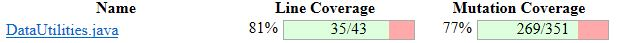
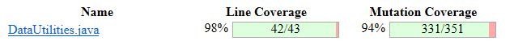
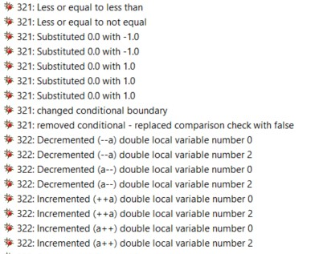

**SENG 637 - Dependability and Reliability of Software Systems**

**Lab. Report \#4 – Mutation Testing and Web app testing**

| Group \#:       |  14 |
|-----------------|---|
| Student Names:  |   |
|           Evan Boerchers      |   |
|           Dean Kim      |   |
|                 |   |

# Introduction

This lab covers 2 core concepts of testing. The first concept is mutation testing, a test methodology that is used to validate how well a test suite is designed, and whether it has any weaknesses. This is done by introducing mutants, these being modified code that add bugs in order to test if your current test suite, kills these mutatnts or not. In this lab we will use the test suite in lab 3 to test mutation testing using pitest. We will evaluate our test suite and aim to improve it.

The second part of this lab focuses on GUI and web testing. Given the popularity of websites and GUI the concepts of automating web and GUI testing are very important. To demonstrate the concepts of GUI testing the Selenium plugin was implemented to design our test cases. These automated test cases were executed and the results reported. Additionally, we compared Selenium to another tool, Sikulix.

# Analysis of 10 Mutants of the Range class 

### Mutant 1

Class name: ShiftRangeDoubleZeroCrossingTestCase  
Method name: shiftWithZeroCrossing
Method tested: shift  
Mutant killed:  Y
Mutation:  Removed assignment to member variable range1
Analysis:  This mutant removes the assignment to the range1 variable while calling the shift method, meaning that the changes to range1 the method induces are not stored in the variable. For this reason, this mutant fails the test and is killed. 

### Mutant 2

Class name: ShiftRangeDoubleZeroCrossingTestCase  
Method name: shiftWithZeroCrossing
Method tested: shift  
Mutant killed:  Y
Mutation:  Removed call to org/jfree/data/Range::getLowerBound
Analysis:  This mutant removes the call to the getLowerBound in the assert statement that checks whether the shift method has shifted the bounds of the range correctly, meaning that the assert statement fails. For this reason, the mutant fails the test and is killed.

### Mutant 3

Class name: ShiftRangeDoubleZeroCrossingTestCase  
Method name: shiftWithZeroCrossing
Method tested: shift  
Mutant killed:  Y
Mutation:  Removed conditional - replaced equality check with true
Analysis:  This mutant replaces the check for equality between the getLowerBound and getUpperBound methods that was used to check for an error in earlier versions of Range, where the upper bound method returned would be equal to the lower bound. If the conditional is true, a fail statement for the test case is executed, so for this reason the mutant fails and is killed. 

### Mutant 4

Class name: ShiftRangeDoubleZeroCrossingTestCase  
Method name: shiftWithZeroCrossing
Method tested: shift  
Mutant killed:  Y
Mutation:  Removed call to org/jfree/data/Range::getUpperBound
Analysis:  This mutant removes the call to the getUpperBound in the assert statement that checks whether the shift method has shifted the bounds of the range correctly, meaning that the assert statement fails. For this reason, the mutant fails the test and is killed.

### Mutant 5

Class name: ShiftRangeDoubleZeroCrossingTestCase  
Method name: shiftNoZeroCrossing
Method tested: shift  
Mutant killed:  Y
Mutation:  Removed assignment to member variable range1
Analysis:  This mutant removes the assignment to the range1 variable while calling the shift method, meaning that the changes to range1 the method induces are not stored in the variable. For this reason, this mutant fails the test and is killed. 

### Mutant 6

Class name: RangeExpandToIncludeTest
Method name: expandToIncludeValueOutsideRangeLesser
Method tested: expandToInclude  
Mutant killed:  Y
Mutation:  Removed conditional in first if statement checking if range is equal to null, replace with true
Analysis:  This mutant removes the conditional checking if the range passed to the method is null and replaces it with true, meaning that the method will return a new range of just the value passed to the expandToInclude method. This will cause the range to fail the assertion test that calls getUpperBound and checks if the upper bound is accurate, as it will be replaced with the value passed to the expandToInclude method.

### Mutant 7

Class name: RangeEqualsTest
Method name: No methods catch this mutant
Method tested: equals  
Mutant killed:  N
Mutation:  Replaced boolean return statement false with true after checking if object passed to equals method is instance of range. There is a method in the test suite that calls the equal method on an integer and a Range object, but if this statement is altered in the equals method, this test method will pass and the mutation is unnoticed.

### Mutant 8

Class name: ShiftRangeDoubleZeroCrossingTestCase  
Method name: No methods catch this mutant
Method tested: shift  
Mutant killed:  N
Mutation:  Replaced 0 in max check between value + delta and 0 with -1 in return statement that executes if value is greater than 0.
Analysis:  This mutant isn't killed because there is no test method that calls for a shift by a positive value that would shift the new range's bounds to a value equal to or less than -1.

### Mutant 9

Class name: RangeExpandTest  
Method name: No methods catch this mutant
Method tested: expand  
Mutant killed:  N
Mutation:  Remove call to throw IllegalArgumentException if input range to method is null.
Analysis:  This mutant isn't killed because there is no test method that attempts to use the expand method on a null Range object. The closest test case examines only a Range object with undeclared boundaries.

### Mutant 10

Class name: ShiftRangeDoubleZeroCrossingTestCase  
Method name: No methods catch this mutant
Method tested: shift  
Mutant killed:  N
Mutation:  Replaced 0 in max check between value + delta and 0 with 1 in return statement that executes if value is less than 0.
Analysis:  This mutant isn't killed because there is no test method that calls for a shift by a negative value that would shift the new range's bounds to a value equal to or less than 1.

# Report all the statistics and the mutation score for each test class

## DataUtilities

 

After addition of new test cases, mutation coverage was increased to 94%. The focus of the new test cases were to cover and find mutants that survived. For example if a mutant was found at a certain point in the code that was unexplored, this code needed to be covered. Additionally, input paramters to methods could be tuned to uncover mutants.

 

## Range

 

After addition of new test cases for the Range test class, mutation coverage was increased to 41% - an increase of 15%. The focus of the new test cases were methods of Range not covered in the original test suite - since Range has 15 methods and the previous test suite only developed tests for 7 of them, adding coverage for constrain, getCentralValue, getLength and hashCode methods resulted in improved mutatation coverage. This is contrasted by the DataUtilities test suite, which had extremely high coverage of 94% when initially tested, making it difficult to find opportunities to improve the mutation coverage.

 

# Analysis drawn on the effectiveness of each of the test classes

## DataUtilities Test Suite

Overall this test suite is generally effective based on the high coverage and mutant coverage scores. It is important to note that their are likely equivalent mutants present which will be inflating the score (see later section on this topic).

## Range Test Suite

Even after the addition of the new test cases, mutation coverage remains low at 41%. This could be attributed to the relative complexity of the code, with the class containing methods that have 2-4 conditional logic statements and different return statements for each outcome. This style of code provides many opportunities for mutation, and the current test case is not thorough enough to provide high mutation coverage. A different approach to testing should be taken for the Range class, with addition of assertion statements that cover common mutations such as replacement of conditional statements with true or false booleans.

# A discussion on the effect of equivalent mutants on mutation score accuracy

Equivalent mutants are mutants that do not affect the functionality of the software any differently than the original code. The reason this is such a big deal is that these mutants will give a misleading mutation score. This outcome is due to the fact that any test case that passes on the original software will also pass with the equivalent mutant implemented. 

The problem with the presense of these equivalent mutants is they will inflate the mutation score. If a large number of equivalent mutants exist, then your mutation score will be very high regardless of how robust and well designed the test suite is. The presence of equivalent mutants must always be kept in mind when evaluating the results of mutation testing.

An pair programming effort was made to detect a few equivalent mutants in the Range class using the exploratory method. The focus of the testing was on the surviving mutations, as killed mutants had changes that were already detected by the test suite, meaning they could not be semantically identical to the original code. No obvious equivalent mutations were found in about 300 mutations examined for the Range class. An example of an equivalent mutation for the range class would be to substitute a value in code, such as 0.0, with a functionally identical value, such as 0e-9. 

  
Example of mutations examined for equivalency.  

# A discussion of what could have been done to improve the mutation score of the test suites

In order to improve the mutant coverage score of our test suites the first step is to analyze the results of the Pitest. The goal of this is to observe which mutants are surviving. Based on the mutants that survive a strategy can be implemented to write a test case that will destroy this mutant. To determine what this test case should look like the Pitest tool allows us to view the mutant code. By viewing the code we will be able to determine what methods need to be further tested, and what the inputs for these methods should be in order to expose the mutant. Once determined a test case will be written applying the same principles of lab 2.

By writing these new test cases our mutant coverage scores will increase, meaning that our test suite will be more effective and robust.

# Why do we need mutation testing? Advantages and disadvantages of mutation testing

We need in order to assess the quality of our test suites. Mutants allow us to introduce defects into our program in order to check and see if our test suite will catch these mutants, or if they will get past our testing. This is important because it allows us to improve our testing in the absence of any real defects in the production code.

**Advantages**
- Allows a quantitative measurement of how robust your test suite is.
- Ensures that bugs are unlikely to slip past your testing.

**Disadvantages**
- Time consuming and requires automation
- Boosting mutation score can be time consuming and may not yield any benefits in terms of fixing actualy bugs in your software.

# Explain your SELENUIM test case design process

Our test case design process aimed to isolate single uses of functionality and verify that the worked as expected based on the given data. Given the fact that we as active web users understand how websites should function, we opted to simply record our actions on the given website as we an average user would do so. Once the proper functionality has been performed and recorded, we added assertions to verify that the outcome of these actions was the one that is expected. 

In regards to the data we inputed for each functionality, we tried to use different inputs mainly to verify the outcomes of inproper inputs and proper inputs.

Our test cases can be seen in the Selenium Test Cases folder of this project. Each website has its own selenium project. All tests for the website are run from the respective project.

# Explain the use of assertions and checkpoints

Assertions and checkpoints are needed in order to claim that the test suite is fully automated. Assertions are used to verify the outcome of certain events. Failing any of these assertions means that the test itself has faileed. Assertions are valuable because they allow us to verify GUI functionality without manual checking, which would take to long and is prone to error.

In the case of our test suites we used assertions to verify that the expected output was obtained when we performed the recored actions. For example the assertion was made that give the proper login info the Ikea website should bring the user to the profile page. This expected output was verified with assertions.

# how did you test each functionality with different test data

Using different test data is important to verify different use cases. I.e the resulting outcome of certain functionality will be different based on the data provided. We opted to have different tests using different test data for each functionality. For example, in the case of the login we needed to verify the outcomes of using correct login info and incorrecet login info. To do so 2 tests were created, one using proper login info and one inproper, the resulting assertions were customized based on what the outcome should be for each login scenario. The same goes for the other test functionality.

# Discuss advantages and disadvantages of Selenium vs. Sikulix

### Selenium

**Pros** 
- Easy to learn
- Simple GUI
- Intuitive features
- If elements change there is a recurzive search tool that may rectify the issue
- No programming experience neeeded
- Decent documentation based on popularity

**Cons** 
- Some assertions are hard to implement since the target selector does not work with them
- Elements changing could break test suites
- Plugin for existing web browser
- No error handling support
- No if statements

### Sikulix
**Pros** 
- Poor documentation, not very popular
- Open source
- Can interact with desktop applications
- Picture recognition
- Can be integrated with Selenium
- Do not need element info to verify

**Cons** 
- Resolution dependent
- Platform dependent
- Image matching requires screenshots.
- Image recognition can be faulty at times

# How the team work/effort was divided and managed

Team work was divided equally. For the first part of this lab, Evan focused on mutation testing for data utilities, while Dean focused on the Range class. Results were reported and recorded accordingly. For the second part of the assignment we both aimed to test 2 peices of functionality. Evan did this for the Ikea website while dean did so for Amazon.

The report load was shared and we each wrote sections respective to the tasks we performed in the lab.

# Difficulties encountered, challenges overcome, and lessons learned
The team had some difficulty setting up the PiTest tool, and went through documentation on the PiTest site as well as explanations of fixes for common errors on StackOverflow in order to properly set up the lab. There was a good amount of learning new technologies for this lab as the lab was broken up into 2 separate exercises. The team practiced effective communication and pair programmed to share knowledge whenever possible, greatly speeding up the learning process for our team.

# Comments/feedback on the lab itself
This lab was good overall, very practical and introduces two commonly used tools for testing applications. The team enjoyed working through the lab and has no major criticism or feedback on the lab structure.  
